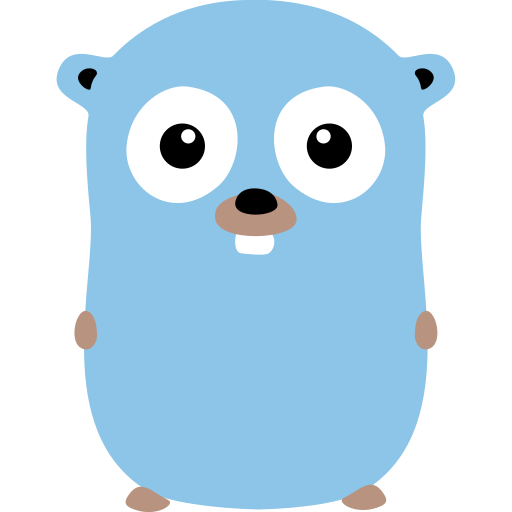

# Resumo do curso GO

||
|--|

## GO a linguagem do Google

1. [Introdução a GO .....................................](docs/cap1.md)
2. [Trabalhando com variáveis .....................](docs/cap2.md)
3. [Controlando o Fluxo do Script ...............](docs/cap3.md)
4. [Requisições web ....................................](docs/cap4.md)
5. [Principais coleções do GO .....................](docs/cap5.md)
6. [Leitura de arquivos .................................](docs/cap6.md)
7. [Escrita de arquivos .................................](docs/cap7.md)

## GO Orientação a Objetos

1. [Variáveis e Structs .................................](docs/cap8.md)
2. [Ponteros e Métodos ..............................](docs/cap9.md)
3. [Retornos, Pacotes e visibilidade ...........](docs/cap9.md)

___